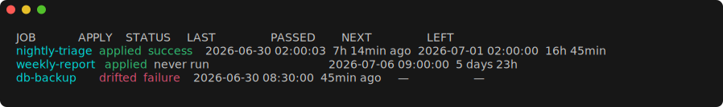

# acron

[](https://github.com/wkentaro/acron/actions/workflows/ci.yml)
[](https://pkg.go.dev/github.com/wkentaro/acron)
[](https://goreportcard.com/report/github.com/wkentaro/acron)
[](LICENSE)

**Cron for unattended agents. One schedule across macOS and Linux, with the
supervision that schedulers leave out: overlap guards, timeouts, log capture,
and a queryable run history.**

acron compiles each Job (a cron schedule plus an agent command) into native OS
scheduler units: systemd user timers on Linux, launchd LaunchAgents on macOS;
Windows is out of scope. The generated unit runs `acron run <job>`, not your
agent directly, so acron supervises every Run from inside the runtime path.
There is no acron daemon; the OS scheduler fires each Run.

acron is agent-agnostic: the agent is just a command to invoke, so it works with
Claude Code, Codex, opencode, or any CLI.

`acron status` shows every Job's apply state, last Run, and next firing at a
glance, color-coded green for healthy, red for drift or failure, and dim for
times and pending work:



## Install

```sh
go install github.com/wkentaro/acron@latest
```

Or download a prebuilt binary from the [GitHub Releases][releases]:

```sh
os=$(uname -s | tr '[:upper:]' '[:lower:]')
arch=$(uname -m); [ "$arch" = x86_64 ] && arch=amd64
curl -fL https://github.com/wkentaro/acron/releases/latest/download/acron-$os-$arch -o acron
chmod +x acron && sudo mv acron /usr/local/bin/
```

To build from source, run `nix develop -c make build` inside the repository.

[releases]: https://github.com/wkentaro/acron/releases

## Quickstart

The first command opens your editor; the rest run to completion.

```sh
acron config edit                 # 1. open $VISUAL/$EDITOR on a commented template (created if absent)
                                  # 2. uncomment the [[job]] block and edit its values
acron apply                       # 3. install the OS scheduler units
acron status                      # 4. verify the job is applied and see when it fires next
acron trigger nightly-triage      # 5. fire it now for a manual test
acron logs nightly-triage         # 6. view the output
```

A minimal Job looks like this:

```toml
[[job]]
name     = "nightly-triage"       # required, unique, [a-z0-9_-]
schedule = "0 2 * * *"            # required, 5-field cron
agent    = ["claude", "-p", "{prompt}", "--dangerously-skip-permissions"]  # required; {prompt} substituted
prompt   = "Triage open issues"   # required
cwd      = "~/src/acron"          # required, absolute or ~-expanded
```

## What you get per Run

Every firing goes through `acron run`, so each Run gets the same supervision no
matter how it was scheduled:

- **Overlap prevention**: a per-job lock; if the previous Run still holds it, the
  new firing is skipped, not stacked on top.
- **Timeout**: the agent gets `SIGTERM` after `timeout` (default `1h`), then
  `SIGKILL` if it ignores it, so a hung run cannot block the next one.
- **Log capture**: stdout and stderr of every Run are saved under the state dir
  and replayable with `acron logs`.
- **Run history**: every Run is appended to `history.jsonl`, queryable from the
  CLI or with `jq`.

`acron history` makes all four visible at once:

```text
JOB             WHEN                 PASSED   STATUS             DURATION
nightly-triage  2026-06-30 23:00:55  10s ago  skipped (overlap)  —
nightly-triage  2026-06-30 23:00:54  11s ago  success            3s
nightly-triage  2026-06-30 23:00:51  14s ago  success            3s
```

The same records live in `history.jsonl`, one JSON object per line, for scripting:

```sh
jq 'select(.status == "skipped")' ~/.local/state/acron/runs/nightly-triage/history.jsonl
```

## Config reference

The Config is a single TOML file declaring all Jobs. Its path is resolved in
order: `$ACRON_CONFIG` if set, otherwise `~/.config/acron/config.toml`
(honoring `$XDG_CONFIG_HOME` when set).

Run `acron config --help` for the full annotated field reference — every
required and optional field, its default, and its semantics — always matching
your installed version. `acron config edit` opens the same template ready to
fill in.

## PATH

`acron apply` snapshots the calling shell's `PATH` and bakes it into each
generated OS unit, because user schedulers start with a minimal environment in
which tools like `claude`, `gh`, and `node` are not on `PATH`. A baked `PATH` is
machine-specific and goes stale when you install new tools, so re-run `acron
apply` after a `brew install` or after updating your agent CLI.

## Commands

| Command               | Description                                                           |
| --------------------- | --------------------------------------------------------------------- |
| `acron apply`         | Reconcile OS scheduler units to the config.                           |
| `acron destroy`       | Remove all acron-owned units from this machine.                       |
| `acron run <job>`     | Run a job now (the entry the scheduler invokes).                      |
| `acron trigger <job>` | Fire a job now, out of schedule, in the background.                   |
| `acron status`        | Show each job's apply state and last run.                             |
| `acron show <job>`    | Show a job's generated unit and whether it matches what is installed. |
| `acron logs <job>`    | Show a job's captured output.                                         |
| `acron logs <job> -f` | Stream the run in progress until it finishes.                         |
| `acron history [job]` | List past runs, newest first.                                         |
| `acron config show`   | Print the config to stdout.                                           |
| `acron config edit`   | Open the config in `$VISUAL`/`$EDITOR`, validating on save.           |

Every command has a `--help` with full column and output documentation.

## Filesystem layout

```
config   $ACRON_CONFIG  or  ~/.config/acron/config.toml
state    ~/.local/state/acron/runs/<job>/<timestamp>.log
         ~/.local/state/acron/runs/<job>/history.jsonl
         ~/.local/state/acron/locks/<job>.lock
units    Linux:  ~/.config/systemd/user/acron-<job>.service
                 ~/.config/systemd/user/acron-<job>.timer
         macOS:  ~/Library/LaunchAgents/com.acron.<job>.plist
```

State honors `$XDG_STATE_HOME` and config honors `$XDG_CONFIG_HOME` when set.

## Contributing

Development uses a Nix devshell that pins the whole toolchain (go, gofumpt,
golangci-lint, dprint, yamlfmt, yamllint). List targets with `nix develop -c
make help`, and verify a change with `nix develop -c make lint && nix develop -c
make test` before sending it. See [DESIGN.md](DESIGN.md) for the architecture.

## License

[MIT](LICENSE) © Kentaro Wada
